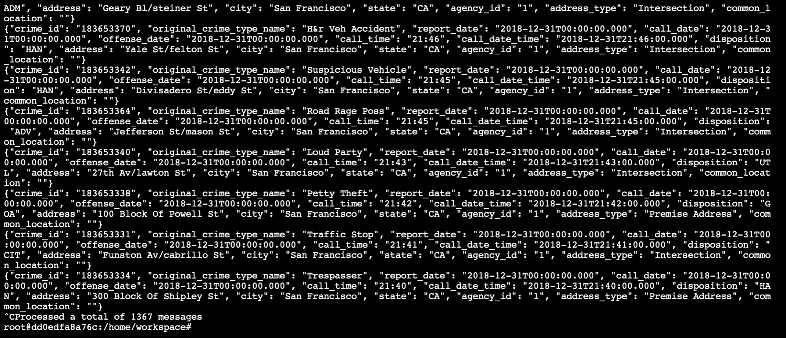
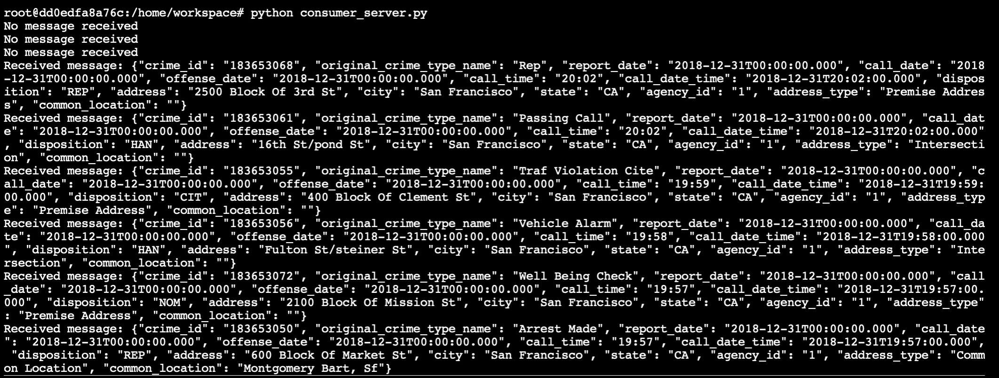
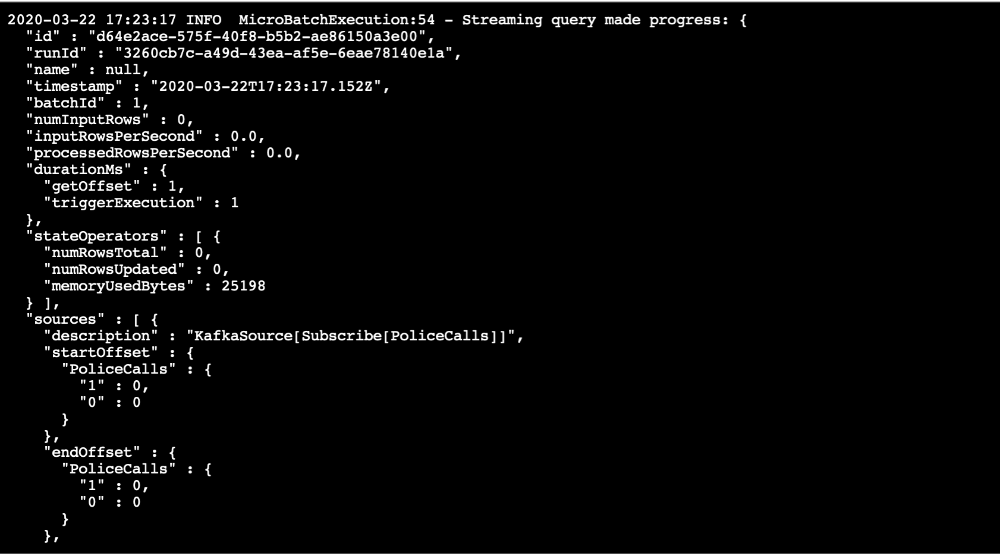
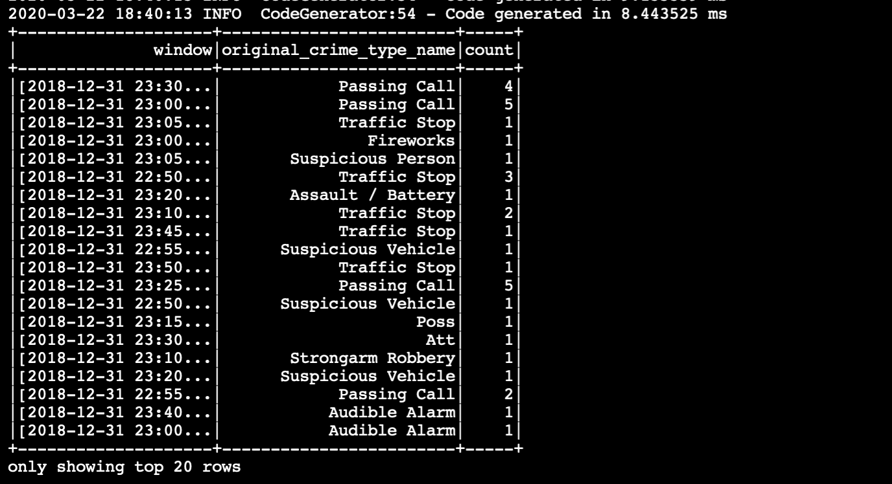

# sf-crime-data-project

A real-world dataset, extracted from Kaggle, on San Francisco crime incidents, and you will provide statistical analyses of the data using Apache Spark Structured Streaming. You will draw on the skills and knowledge you've learned in this course to create a Kafka server to produce data, and ingest data through Spark Structured Streaming.

This project is for the Data Streaming nanodegree 

All screenshots are attached

# Producer

# Consumer 

# Data Streaming - Spark 

# Spark Count 

